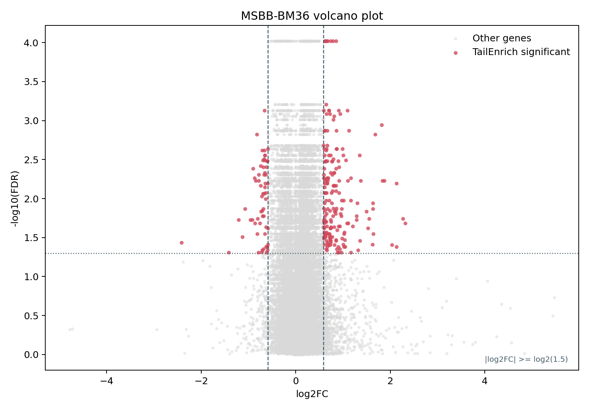
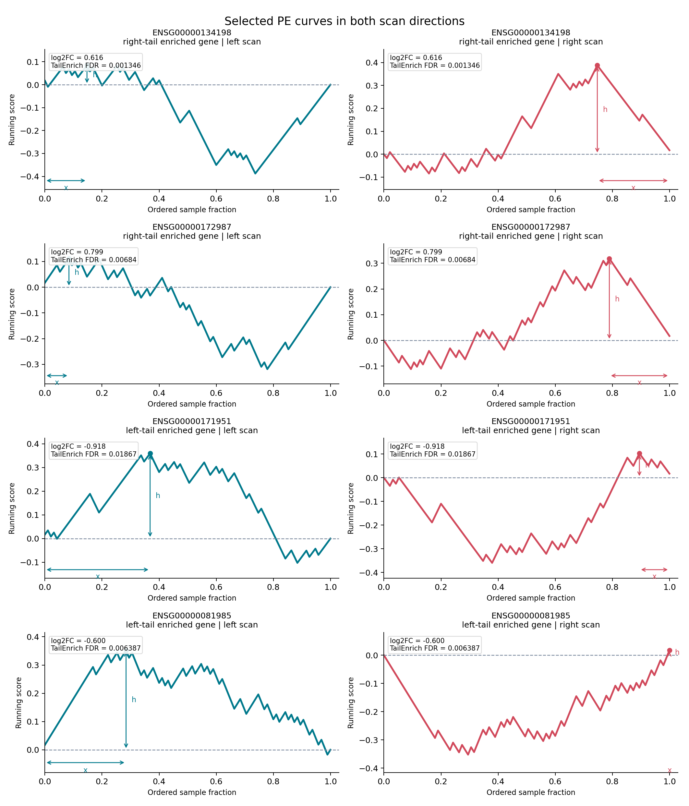

# TailEnrich

`TailEnrich` is an R implementation for detecting genes with case/control enrichment at expression distribution tails. The repository includes the core method, runnable example scripts, one real-data example dataset, preprocessing code for covariate-adjusted input generation, example output files, and figures used in this README.

## Repository Contents

- `src/tailEnrich.R`: core TailEnrich implementation.
- `scripts/run_tailEnrich.R`: repository-relative R runner.
- `scripts/run_sample.sh`: one-command script for running the example dataset.
- `scripts/prepare_covariate_adjusted_input.R`: covariate-adjustment script for preparing the example input.
- `scripts/plot_sample_volcano.py`: volcano plot script for the example dataset.
- `scripts/plot_selected_pe_curves.py`: PE-curve plotting script for selected genes.
- `sample_input/MSBB-BM36/`: example input dataset.
- `sample_output/MSBB-BM36/`: TailEnrich output and an `edgeR` reference table.
- `results/selected_genes.tsv`: genes used in the PE-curve figure.
- `figures/`: README figures.

## Core Dependencies

### Required to run TailEnrich

- `bash` or `sh`
- `R >= 4.2`
- base R `parallel`

The core TailEnrich analysis does not require additional CRAN or Bioconductor packages.

### Optional for rebuilding figures

- `Python >= 3.10`
- `matplotlib`

## Input Format

Each dataset directory should contain:

1. `gene_TPM_by_salmon_covAdjusted.csv`
   - first column: gene ID
   - remaining columns: expression values
   - header row: sample IDs
2. `used_samples_group.tsv`
   - required columns: `sampleID`, `group`
   - `group` must be coded as `-1` and `1`

For the example dataset, the repository also includes the files used to generate the covariate-adjusted expression matrix:

- `gene_TPM_by_salmon.csv`: raw TPM matrix before covariate removal
- `MSBB36_control_isoform_covarites.csv`: sample-level covariate table
- `isoform_sample.txt`: original case/control sample definition
- `used_covariates.txt`: covariates selected for removal in this dataset

The example dataset is stored under `sample_input/MSBB-BM36/`:

- `sample_input/MSBB-BM36/gene_TPM_by_salmon.csv`
- `sample_input/MSBB-BM36/gene_TPM_by_salmon_covAdjusted.csv`
- `sample_input/MSBB-BM36/MSBB36_control_isoform_covarites.csv`
- `sample_input/MSBB-BM36/isoform_sample.txt`
- `sample_input/MSBB-BM36/used_covariates.txt`
- `sample_input/MSBB-BM36/used_samples_group.tsv`

## Method Overview

TailEnrich tests whether disease samples are preferentially enriched at the low-expression or high-expression tail of each gene. For a gene expression matrix $`X \in \mathbb{R}^{m \times n}`$, rows correspond to genes and columns correspond to samples. The sample-label vector is coded as $`y_i = +1`$ for disease samples and $`y_i = -1`$ for control samples.

For each gene, TailEnrich evaluates two ranked directions:

* `L2H`: samples are ranked from low to high expression; this corresponds to left-tail enrichment.
* `H2L`: samples are ranked from high to low expression; this corresponds to right-tail enrichment.

Within each ranked direction, labels are centered to reduce the effect of group-size imbalance:

```math
\tilde{y}_i = y_i - \bar{y}, \qquad \bar{y}=\frac{1}{n}\sum_{i=1}^{n}y_i.
```

For each prefix of the ranked samples, TailEnrich calculates the cumulative enrichment of disease labels:

```math
H(t)=\frac{\sum_{i=1}^{t}\tilde{y}_i}{\sum_{i=1}^{n}I(\tilde{y}_i>0)\tilde{y}_i}, \qquad 1 \leq t \leq n.
```

The PE-height is the maximum value of this ranked enrichment curve:

```math
h = \max_{1 \leq t \leq n} H(t).
```

Let $`t^*`$ be the first ranked position where the maximum is reached, and let $`x`$ be its normalized position in the ranked sample sequence. The PE-score combines the enrichment height with a positional weight:

```math
\mathrm{PE} = h(1-x).
```

This weighting gives larger scores to enrichment peaks that occur closer to the expression tail. TailEnrich computes one PE-score for `L2H` and one for `H2L`, then uses the larger value as the observed statistic for the gene:

```math
T_j = \max(\mathrm{PE}_{j,\mathrm{L2H}}, \mathrm{PE}_{j,\mathrm{H2L}}).
```

Statistical significance is estimated by permutation testing. Sample labels are randomly permuted while the expression matrix is kept fixed. For each permutation, TailEnrich recomputes the best PE-score for every gene and pools these permuted scores into a common empirical null distribution. The permutation p-value for gene $`j`$ is calculated as:

```math
p_j = \frac{\{T^{\mathrm{perm}} \geq T_j\}}{B \times m},
```

where $`B`$ is the number of permutations and $`m`$ is the number of genes. The resulting p-values are adjusted across genes using the Benjamini--Hochberg procedure.


## Quick Start

Run TailEnrich on the example dataset:

```bash
bash scripts/run_sample.sh
```

If `Rscript` is not available on `PATH`, specify its location:

```bash
RSCRIPT_BIN=/path/to/Rscript bash scripts/run_sample.sh
```

Main environment variables:

- `TAILENRICH_INPUT_ROOT`: dataset root, default `sample_input`
- `TAILENRICH_OUTPUT_ROOT`: output root, default `sample_output_rerun`
- `TAILENRICH_DATASETS`: comma-separated dataset names, default `MSBB-BM36`
- `TAILENRICH_N_CORES`: number of cores, default `1`
- `TAILENRICH_N_PERM`: permutation count, default `1000`
- `TAILENRICH_SEED`: random seed, default `1`
- `TAILENRICH_FDR_CUTOFF`: significance cutoff, default `0.05`

## Preprocessing Workflow

The example dataset uses the following preprocessing steps:

1. Start from the raw TPM matrix `gene_TPM_by_salmon.csv`.
2. Read the sample-level covariate table `MSBB36_control_isoform_covarites.csv`.
3. Keep the covariates listed in `used_covariates.txt`.
4. Use `isoform_sample.txt` to define `exp = 1` and `ctrl = -1`, then write `used_samples_group.tsv`.
5. Remove covariate effects from the TPM matrix and write `gene_TPM_by_salmon_covAdjusted.csv`.
6. Run TailEnrich on the covariate-adjusted TPM matrix.

The preprocessing step can be reproduced with:

```bash
Rscript scripts/prepare_covariate_adjusted_input.R \
  --expr sample_input/MSBB-BM36/gene_TPM_by_salmon.csv \
  --covariates sample_input/MSBB-BM36/MSBB36_control_isoform_covarites.csv \
  --sample-file sample_input/MSBB-BM36/isoform_sample.txt \
  --used-covariates sample_input/MSBB-BM36/used_covariates.txt \
  --out-expr sample_input/MSBB-BM36/gene_TPM_by_salmon_covAdjusted.csv \
  --out-groups sample_input/MSBB-BM36/used_samples_group.tsv
```

In the full paper workflow, TailEnrich is run on covariate-adjusted TPM matrices. The comparison `edgeR` analysis is run separately on raw count data using a covariate-aware design.

## Example Dataset

The repository includes one example dataset, `MSBB-BM36`. This dataset was selected because its TailEnrich significant-gene count is close to the mean TailEnrich count across the 12-dataset benchmark set after excluding the maximum-count dataset.

Example input files:

- `sample_input/MSBB-BM36/gene_TPM_by_salmon.csv`
- `sample_input/MSBB-BM36/gene_TPM_by_salmon_covAdjusted.csv`
- `sample_input/MSBB-BM36/MSBB36_control_isoform_covarites.csv`
- `sample_input/MSBB-BM36/isoform_sample.txt`
- `sample_input/MSBB-BM36/used_covariates.txt`
- `sample_input/MSBB-BM36/used_samples_group.tsv`

Example output files:

- `sample_output/MSBB-BM36/tailEnrich.tsv`
- `sample_output/MSBB-BM36/tailEnrich_sig.tsv`
- `sample_output/MSBB-BM36/edgeR.tsv`

In this dataset:

- TailEnrich significant genes: `253`
- `edgeR` significant genes: `1445`
- selected PE-curve examples: genes significant in TailEnrich but not significant in `edgeR`

## Output Columns

The main TailEnrich result table includes:

- `gene_id`
- `log2FC`
- `PValue`
- `FDR`
- `PE_L2H`, `PE_H2L`
- `PeakH_L2H`, `PeakH_H2L`
- `PeakX_L2H`, `PeakX_H2L`
- `direction_best`
- `TE_score_any`
- `score`

Interpretation:

- `L2H` denotes the low-to-high ranking direction and corresponds to low-expression tail enrichment.
- `H2L` denotes the high-to-low ranking direction and corresponds to high-expression tail enrichment.
- `direction_best` records the ranking direction with the larger PE-score.
- `log2FC` is the direction-specific tail fold change.
- `PValue` and `FDR` summarize permutation-based significance.
- `score` is `-log10(PValue)` and is provided for ranking and visualization.

## Figures

### Volcano Plot

This volcano plot uses only the `MSBB-BM36` example dataset. Red points satisfy both `TailEnrich FDR < 0.05` and `|log2FC| >= log2(1.5)`. Non-significant genes are shown in gray.



### Annotated PE Curves

The PE-curve examples were selected from genes that satisfy the following criteria:

- significant in TailEnrich,
- non-significant in `edgeR`,
- selected to show representative tail-enrichment patterns rather than only the smallest FDR values.

The exact gene list is stored in `results/selected_genes.tsv`. For display, `H2L` curves are mirrored horizontally so the enriched high-expression tail appears on the right side of the panel.



## Results and Interpretation

In the `MSBB-BM36` example dataset, TailEnrich identifies `253` significant genes. The included `edgeR` reference table identifies `1445` significant genes under the corresponding comparison workflow.

The selected PE curves highlight genes that are significant in TailEnrich but not significant in `edgeR`. These examples illustrate tail-structured case/control differences that may not appear as standard mean-shift differential expression signals.

These results support the intended use of TailEnrich as a complementary analysis to conventional differential expression methods. TailEnrich is designed to detect subgroup-level enrichment at expression tails rather than to replace global-shift differential expression analysis.

## Rebuild Figures

```bash
python scripts/plot_sample_volcano.py
python scripts/plot_selected_pe_curves.py
```

## Directory Layout

```text
TailEnrich_github_repo/
|- README.md
|- figures/
|- results/
|- sample_input/
|- sample_output/
|- scripts/
`- src/
```
